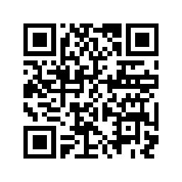

<!--
pandoc README.md -o Toni_Peraira_RA2_2.5.pdf --from markdown --template eisvogel --listings --pdf-engine=xelatex --toc -s -V toc-title:"Índex"
-->

Caracteritza altres sistemes de comunicació sense fils i les seves vulnerabilitats.

- [Quin és el model de comunicació de bluetooth 1.0 i 2.0, quin model d'autenticació utilitza?](#quin-és-el-model-de-comunicació-de-bluetooth-10-i-20-quin-model-dautenticació-utilitza)
- [Quin és el model de comunicació de bluetooth 3.0, quin model d'autenticació utiltiza?](#quin-és-el-model-de-comunicació-de-bluetooth-30-quin-model-dautenticació-utiltiza)
- [Llista eines que es poden fer servir per hackejar sistemes bluetooth](#llista-eines-que-es-poden-fer-servir-per-hackejar-sistemes-bluetooth)
- [Què és NFC? Quin és el seu ús més freqüent?](#què-és-nfc-quin-és-el-seu-ús-més-freqüent)
- [Què és QR? Quin és el seu ús més freqüent?](#què-és-qr-quin-és-el-seu-ús-més-freqüent)
- [Genera un codi QR i afegeix-lo a l'informe.](#genera-un-codi-qr-i-afegeix-lo-a-linforme)

## Quin és el model de comunicació de bluetooth 1.0 i 2.0, quin model d'autenticació utilitza?

https://ns2.elhacker.net/timofonica/facu/PFC.Seguridad.en.Bluetooth.pdf

https://www.toengel.net/studium/mm_and_sec/bluetooth.pdf

https://www.ccn-cert.cni.es/series-ccn-stic/800-guia-esquema-nacional-de-seguridad/2707-ccn-stic-837-ens-seguridad-en-bluetooth/file.html

Secure Simple Pairing (SSP)

Legacy Authentication
 Autenticación unidireccional.
Mutua opcional.
 Algoritmo E1 basado en SAFER+

https://www.xataka.com/basics/bluetooth-diferencias-caracteristicas-sus-clases-versiones

## Quin és el model de comunicació de bluetooth 3.0, quin model d'autenticació utiltiza?

https://blog.330ohms.com/2017/02/02/bluetooth-clases-y-versiones-desde-v1-0-hasta-v5-0/

Bluetooth 3.0. Sin sucesiones. Se incorporó la características HS -High Speed-, lo que lo hace apto para transferencia de paquetes que contienen más datos de los que se requieren tales como archivos de video y musicales, además de que se hace uso de este atributo cuando se requiere. Además su tasa de transferencia es de 24 Mbps.

## Llista eines que es poden fer servir per hackejar sistemes bluetooth

https://en.kali.tools/all/?category=bluetooth (29 tools)
https://www.tutorialspoint.com/wireless_security/wireless_security_bluetooth_hacking_tools.htm

kali:

hciconfig

hcitool

sdptool

l2ping

## Què és NFC? Quin és el seu ús més freqüent?

https://www.xataka.com/basics/nfc-android-que-como-activarlo-se-puede-usar
https://es.wikipedia.org/wiki/Comunicación_de_campo_cercano

Per mí el seu ús més freqüent és el de fer-ho servir pel DNI electrònic.

Pago con el teléfono móvil. Identificación. Automatización de acciones

## Què és QR? Quin és el seu ús més freqüent?

https://es.wikipedia.org/wiki/Código_QR
https://www.kaspersky.es/resource-center/definitions/what-is-a-qr-code-how-to-scan

## Genera un codi QR i afegeix-lo a l'informe.

Per generar un codi QR he fet el següent codi en JavaScript:

```js
import QRCode from "qrcode-svg";

/**
 * Generate a QR code with a specific content. The QR code is saved in a SVG file, for the best image quality.
 * @param {String} filename Name of the file with the QR code.
 * @param {String} content QR content.
 */
const generateQR = async (filename, content) => {
    try {
        // QR code options.
        let qrcode = new QRCode({
            content,
            padding: 5,
            width: 256,
            height: 256,
            color: "#000",
            background: "#fff",
            ecl: "M" // error correction level
        });

        // Save file.
        qrcode.save(filename + ".svg", (err) => {
            if (err) throw err;
            console.log("QR Generated!");
        });
    } catch (err) {
        console.error("Error generating QR code", err)
    }
}

generateQR("qr", "https://toni-pm.herokuapp.com");
```

